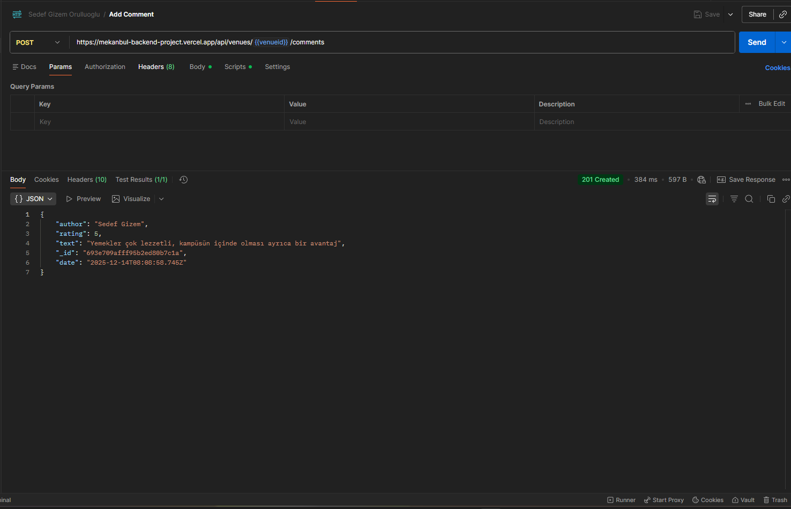
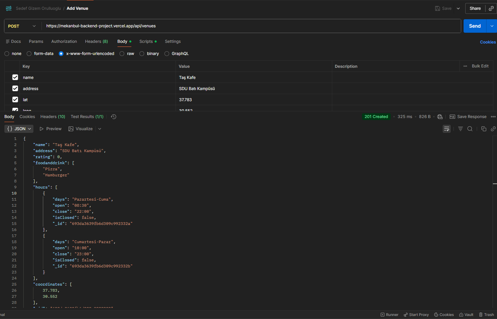
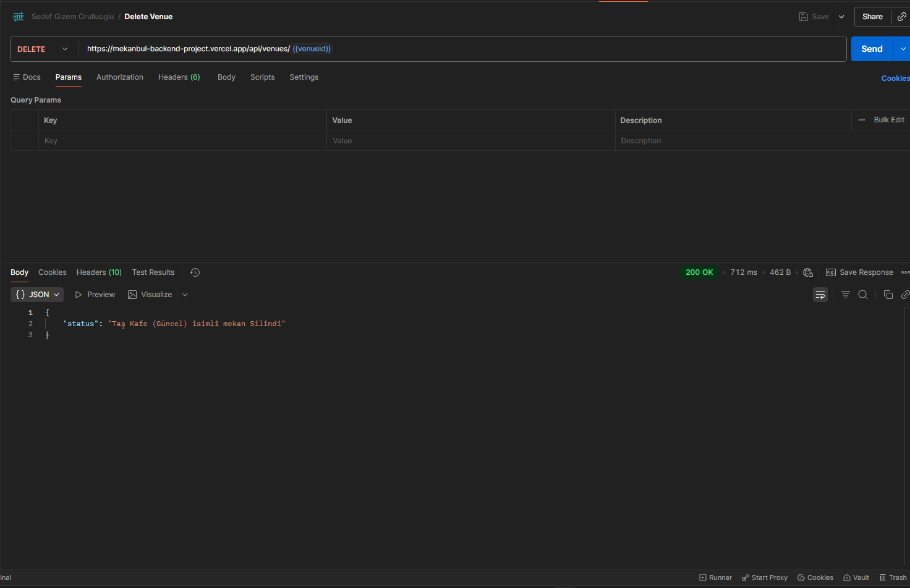
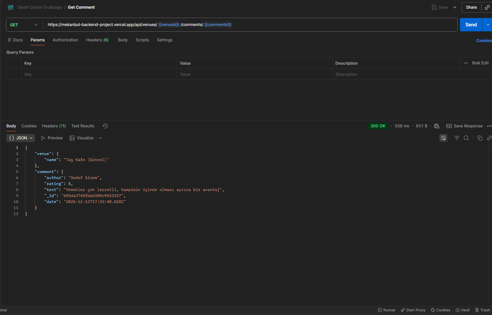
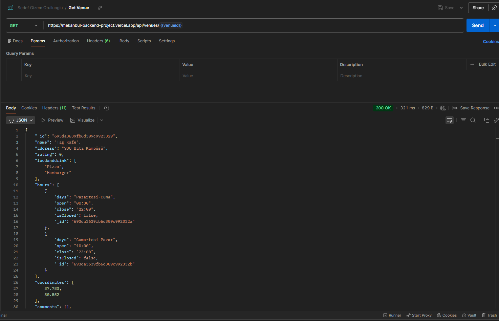
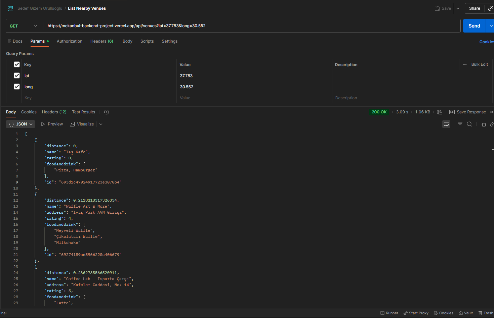
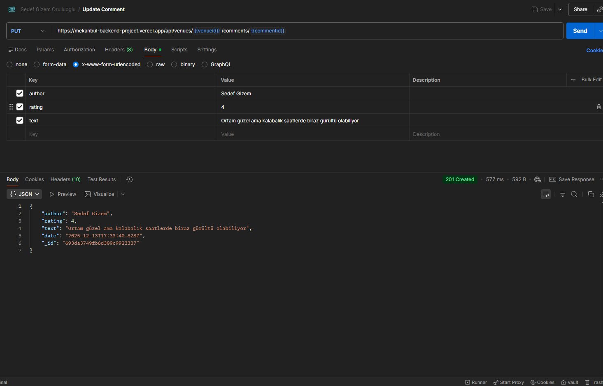
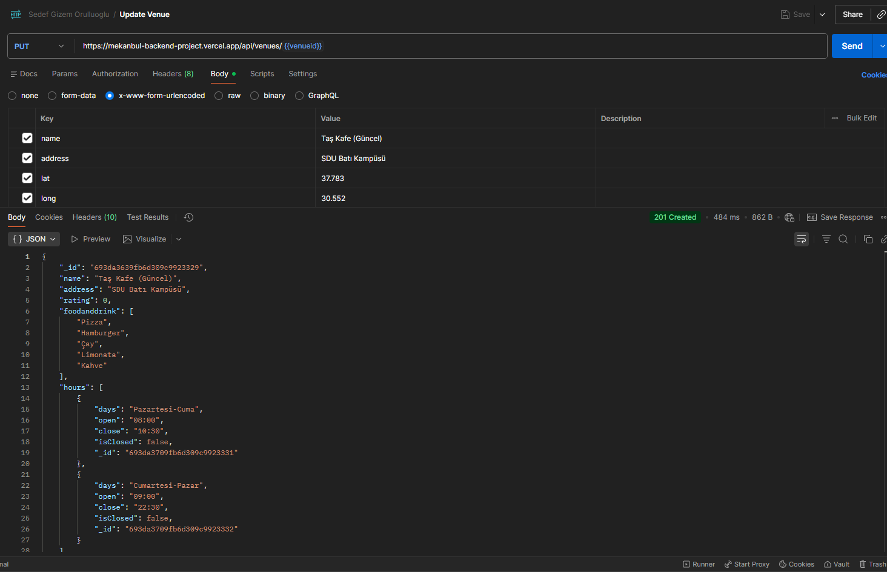

# MekanBul Backend API

Bu proje, **MekanBul** uygulamasının backend servisidir.  
Node.js, Express ve MongoDB Cloud kullanılarak geliştirilmiştir.  
API, mekan (venue) ve yorum (comment) işlemlerini RESTful mimariyle sunar.

Proje **Vercel** üzerinde canlıya alınmıştır.

---

## 🚀 Canlı Uygulama (Vercel)

🔗 **Vercel Deployment URL:**  
https://mekanbul-backend-project.vercel.app

---

## 🧰 Kullanılan Teknolojiler

- Node.js
- Express.js
- MongoDB Atlas (Cloud)
- Mongoose
- Postman
- Vercel

---

## ⬇️ Projeyi Çalıştırma

```bash
git clone https://github.com/SGizem/Mekanbul-Backend-Project.git
cd Mekanbul-Backend-Project
npm install
npm start
```

---

## 📌 API Endpointleri

### 📍 Mekan (Venue) İşlemleri

| Method | Endpoint | Açıklama |
|------|--------|---------|
| POST | /api/venues | Yeni mekan ekler |
| GET | /api/venues?lat=37&long=35 | Yakındaki mekanları listeler |
| GET | /api/venues/:venueid | Tek bir mekanı getirir |
| PUT | /api/venues/:venueid | Mekanı günceller |
| DELETE | /api/venues/:venueid | Mekanı siler |

---

### 💬 Yorum (Comment) İşlemleri

| Method | Endpoint | Açıklama |
|------|--------|---------|
| POST | /api/venues/:venueid/comments | Mekana yorum ekler |
| GET | /api/venues/:venueid/comments/:commentid | Yorumu getirir |
| PUT | /api/venues/:venueid/comments/:commentid | Yorumu günceller |
| DELETE | /api/venues/:venueid/comments/:commentid | Yorumu siler |

---

## 🧪 Postman Testleri

- Tüm API’ler Postman Collection altında test edilmiştir.
- venueid ve commentid değişkenleri otomatik set edilmektedir.

---

### 🧪 Postman Test Sonucu: Aşağıda Postman ile alınmış test sonuçlarının ekran görüntüleri bulunmaktadır.

### Add Comment (POST İşlemi)


### Add Venue (POST İşlemi)


### Delete Comment (DELETE İşlemi)


### Delete Venue (DELETE İşlemi)


### Get Comment (GET İşlemi)


### Get Venue (GET İşlemi)


### List Nearby Venues (GET İşlemi)


### Update Comment (PUT İşlemi)


### Update Venue (PUT İşlemi)


---
